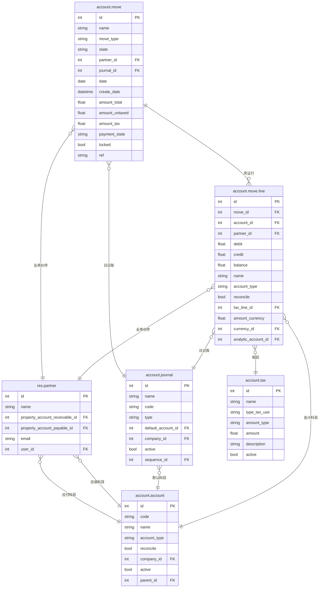

# Accounting 数据模型

## ER 关系图



## 核心表字段说明

### account.move（会计凭证）

| 字段名 | 类型 | 说明 | 业务含义 |
|--------|------|------|---------|
| id | int | 主键 | 唯一标识 |
| name | char | 凭证号 | 凭证编号（自动或手动） |
| move_type | selection | 类型 | entry/invoice/receipt/payment... |
| state | selection | 状态 | draft/posted/cancelled |
| partner_id | many2one | 业务伙伴 | 客户/供应商 |
| journal_id | many2one | 日记账 | 关联的日记账 |
| date | date | 日期 | 凭证日期 |
| amount_untaxed | float | 未税金额 | 税额前合计 |
| amount_tax | float | 税额 | 税额合计 |
| amount_total | float | 总金额 | 含税总金额 |
| payment_state | selection | 付款状态 | not_paid/partial/paid/reversed |
| ref | char | 参照 | 参考号/备注 |

### account.move.line（凭证行）

| 字段名 | 类型 | 说明 | 业务含义 |
|--------|------|------|---------|
| id | int | 主键 | 唯一标识 |
| move_id | many2one | 所属凭证 | 关联的 account.move |
| account_id | many2one | 会计科目 | 记账科目 |
| partner_id | many2one | 业务伙伴 | 客户/供应商 |
| debit | float | 借方金额 | 借方发生额 |
| credit | float | 贷方金额 | 贷方发生额 |
| balance | float | 余额 | debit - credit |
| name | char | 摘要 | 凭证行描述/摘要 |
| account_type | selection | 科目类型 | 来自关联科目的类型 |
| reconcile | bool | 可核销 | 是否参与核销（应收账款/应付账款） |
| tax_line_id | many2one | 税目 | 关联的税 |
| amount_currency | float | 外币金额 | 外币金额 |
| currency_id | many2one | 币种 | 外币币种 |
| analytic_account_id | many2one | 辅助核算 | 管理账/项目核算 |

### account.account（会计科目）

| 字段名 | 类型 | 说明 | 业务含义 |
|--------|------|------|---------|
| id | int | 主键 | 唯一标识 |
| code | char | 科目编码 | 如：1001（库存现金） |
| name | char | 科目名称 | 科目全称 |
| account_type | selection | 科目类型 | 资产/负债/权益/收入/费用 |
| reconcile | bool | 可核销 | 设为true则允许核销应收/应付 |
| company_id | many2one | 公司 | 所属公司 |
| active | bool | 有效 | 是否启用 |
| parent_id | many2one | 上级科目 | 科目层级 |

### account.journal（日记账）

| 字段名 | 类型 | 说明 | 业务含义 |
|--------|------|------|---------|
| id | int | 主键 | 唯一标识 |
| name | char | 名称 | 日记账名称 |
| code | char | 代码 | 简称（如：CR/BK） |
| type | selection | 类型 | sale/purchase/cash/bank/general |
| default_account_id | many2one | 默认科目 | 该日记账的默认科目 |
| company_id | many2one | 公司 | 所属公司 |
| active | bool | 有效 | 是否启用 |

## 业务场景映射

### move_type 枚举说明

| move_type | 名称 | 说明 |
|-----------|------|------|
| entry | 分录 | 手工凭证/调账 |
| out_invoice | 销售发票 | 发票（客户） |
| out_refund | 销售退款 | 贷项通知单 |
| in_invoice | 供应商发票 | 采购发票 |
| in_refund | 供应商退款 | 采购退款 |
| in_receipt | 供应商收据 | 采购付款凭证 |
| out_receipt | 客户收据 | 销售收款凭证 |

### 借贷平衡原则

**每笔凭证必须满足：总借方 = 总贷方**

```
示例 - 销售商品 1000 元（含税13%）：

  借：应收账款        1,130
      贷：销售收入         1,000
      贷：应交税额           130
```

- `account.move.line.debit` = 借方金额
- `account.move.line.credit` = 贷方金额
- `debit - credit = balance`（单行余额）
- 整个凭证的 `sum(debit) = sum(credit)`

### 科目分类

| account_type | 类型 | 方向 | 示例 |
|-------------|------|------|------|
| asset | 资产 | 借方增加 | 1001库存现金, 1122应收账款 |
| liability | 负债 | 贷方增加 | 2001短期借款, 2202应付账款 |
| equity | 权益 | 贷方增加 | 3001实收资本, 3104本年利润 |
| income | 收入 | 贷方增加 | 6001销售收入 |
| expense | 费用 | 借方增加 | 6601管理费用, 6401销售成本 |

### 核销机制（Reconciliation）

- `account_id.reconcile = true` → 科目允许部分核销
- 典型场景：客户多次付款、供应商分批结算
- 核销后 `reconciled = true`，余额清零

### 销售发票流程

```
1. 创建销售发票   → account.move (move_type='out_invoice', state='draft')
2. 过账发票       → account.move (state='posted')
   → 生成凭证行：借 应收账款，贷 销售收入 + 销项税
3. 收到付款       → account.move (move_type='entry')
   → 生成凭证行：借 银行存款，贷 应收账款
4. 核销           → 付款与发票核销，余额清零
```

### 供应商账单流程

```
1. 创建供应商账单 → account.move (move_type='in_invoice', state='draft')
2. 过账账单       → account.move (state='posted')
   → 生成凭证行：借 采购成本 + 进项税，贷 应付账款
3. 付款           → account.payment → 生成付款凭证
4. 核销           → 付款与账单核销
```
