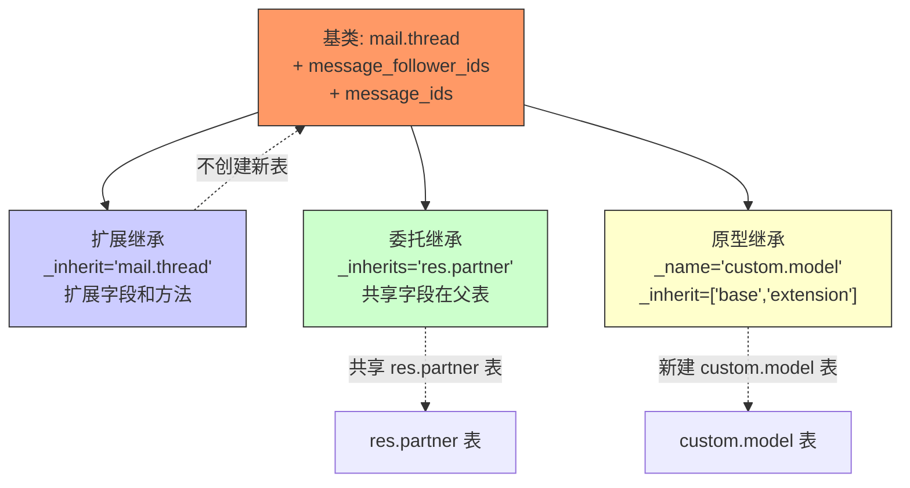
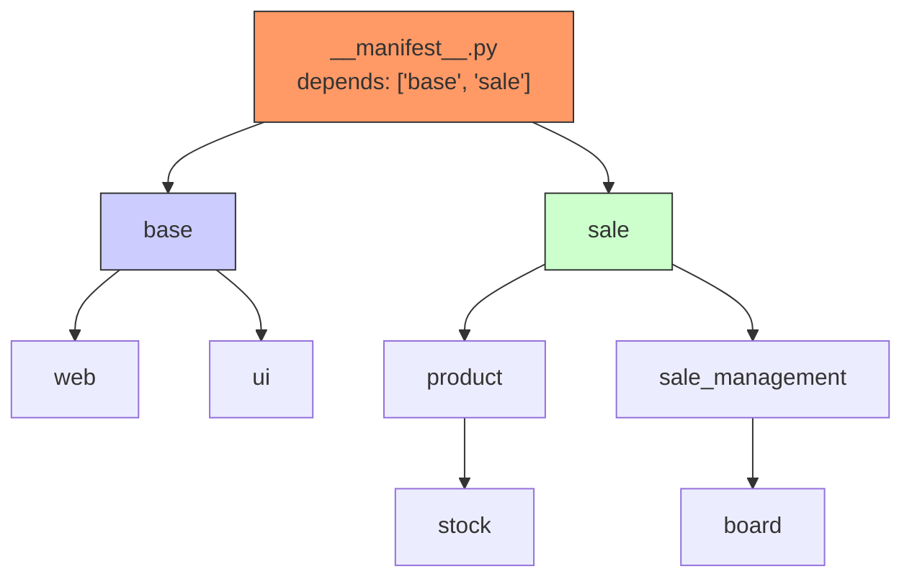
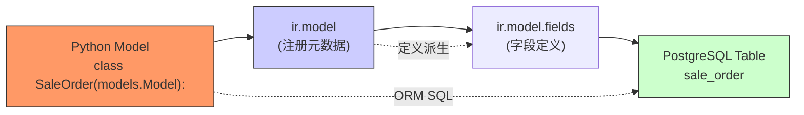

# Odoo 架构数据模型

## 元模型 ER 图（模型注册表）

```mermaid
erDiagram
    ir_model ||--o{ ir_model_fields : "字段定义"
    ir_model ||--o{ ir_model_constraint : "数据库约束"
    ir_model ||--o{ ir_model_relation : "外键关系"
    ir_module_module ||--o{ ir_model : "模块注册模型"
    ir_model_fields ||--o{ ir_model_selection : "选择值列表"
    ir_model_access ||--|| res_groups : "权限组"
    ir_model_access ||--|| ir_model : "访问控制"

    ir_model {
        int id PK
        string name "模型名称，如 res.partner"
        string model "Python 类名，如 res.partner"
        string info "模型描述"
        int module FK
        string state "manual/base"
        bool transient "是否为临时表"
        datetime create_date
    }

    ir_model_fields {
        int id PK
        int model_id FK
        string name "字段名，如 partner_id"
        string field_description "界面显示名"
        string ttype "char/integer/boolean/many2one/..."
        string help "字段帮助文本"
        int relation_id FK "关联模型（m2o/o2m）"
        string on_delete "cascade/restrict/set null"
        bool required "必填"
        bool readonly "只读"
        int size "字段长度（char）"
        float digits "数字精度 (6,2)"
        bool tracking "消息跟踪"
        int index "是否建索引"
        bool store "是否存数据库"
        string compute "计算字段方法"
        string related "关联字段路径"
    }

    ir_model_selection {
        int id PK
        int field_id FK
        string name "显示文本"
        string value "存储值"
        int sequence
    }

    ir_model_access {
        int id PK
        string name
        int model_id FK
        int group_id FK
        string perm_read "r"
        string perm_write "w"
        string perm_create "c"
        string perm_unlink "d"
    }

    ir_module_module {
        int id PK
        string name "模块技术名"
        string state "installed/uninstalled/to upgrade"
        string version
    }
}
```

## ORM 三种继承类型对比



### 1. 扩展继承（`_inherit`）

```python
class HrEmployeePublic(models.Model):
    _name = 'hr.employee.public'
    _inherit = 'hr.employee'      # 扩展 hr.employee
    _description = 'Employee (Public)'

    # 添加新字段，自动追加到 hr.employee 表
    google_drive_link = fields.Char()
```

- **不创建新表**，直接在父表上扩展
- 用于为现有模型添加安全字段或公开字段
- 典型场景：`hr.employee.public` = 员工公开信息视图（更严格的权限控制）

### 2. 委托继承（`_inherits`）

```python
class ResUsers(models.Model):
    _name = 'res.users'
    _inherits = {'res.partner': 'partner_id'}  # 委托给 partner

    partner_id = fields.Many2one('res.partner', required=True, ondelete='cascade')
    login = fields.Char(required=True)
    password = fields.Char()
    share = fields.Boolean()  # 只在 res.users 表
```

- **自动创建新表**，字段分散在两个表（父表 + 子表）
- `res.users` 的记录同时是 `res.partner` 的记录（通过外键 `partner_id`）
- 删除子表记录，级联删除父表记录
- 典型场景：用户（res.users）继承自联系人（res.partner），共享地址等字段

### 3. 原型继承（`_name` + `_inherit` 列表）

```python
class SaleOrderLineCode(models.Model):
    _name = 'sale.order.line.code'   # 新表
    _inherit = ['sale.order.line',   # 继承标准订单行
                'ir.needaction_mixin']  # 可混入多个
    _description = 'Sale Order Line with Code'

    # 全新表，字段从多个父类合并
    item_code = fields.Char(string="Item Code")
```

- **创建新表**，从多个父类合并字段和方法
- 典型场景：产品特殊变体、业务定制扩展

### 对比总结

| 特性 | `_inherit` | `_inherits` | `_name`+`_inherit` |
|------|-----------|------------|---------------------|
| 创建新表 | ❌ | ✅ | ✅ |
| 字段位置 | 父表 | 分散父表+子表 | 新表 |
| 访问方式 | 通过父表 | 通过子表访问父表 | 通过新表 |
| on_delete | 不适用 | 必须 cascade | 不适用 |
| 典型场景 | 安全字段扩展 | res.users/partner | 业务定制变体 |

## 模块依赖解析



### 加载顺序规则

```
1. 依赖按字母顺序排拓扑
2. 同一模块的多个依赖先加载
3. base 模块永远最先加载
4. 循环依赖 Odoo 会报错
```

### __manifest__.py 示例

```python
{
    'name': 'Custom Sale Report',
    'version': '1.0',
    'category': 'Sales',
    'depends': [
        'sale',        # 依赖销售模块
        'report_xlsx', # 依赖报表模块
    ],
    'data': [
        'views/sale_report_view.xml',
        'reports/sale_report_template.xml',
    ],
    'installable': True,
    'application': False,
}
```

## 技术层关系



### ORM 与数据库映射

| ORM 层 | 数据库层 | 说明 |
|--------|---------|------|
| `models.Model` | PostgreSQL 表 | 每个模型一张表 |
| `fields.Char()` | `varchar(n)` | 字符字段 |
| `fields.Integer()` | `integer` | 整数 |
| `fields.Float()` | `numeric` | 浮点数 |
| `fields.Boolean()` | `boolean` | 布尔 |
| `fields.Date()` | `date` | 日期 |
| `fields.Datetime()` | `timestamp` | 日期时间 |
| `fields.Text()` | `text` | 长文本 |
| `fields.Many2one()` | `integer FK` | 外键（自动建索引） |
| `fields.One2many()` | 无独立列 | 通过外键反向查询 |
| `fields.Many2many()` | 关联表 | 自动生成 `model1_model2_rel` 表 |
| `fields.Binary()` | `bytea` | 二进制/文件 |
| `fields.Html()` | `text` | 富文本内容 |

### 字段属性映射到数据库

```python
# Odoo ORM 定义
name = fields.Char(string="Order Name", size=64, required=True, index=True)
# ↓ 生成 PostgreSQL
"name" VARCHAR(64) NOT NULL,  -- size → VARCHAR(64)
#                         ↑ index=True → CREATE INDEX

# 计算字段不存储
computed_name = fields.Char(compute='_compute_name', store=False)
# ↓ 不生成数据库列

# 关联字段
partner_id = fields.Many2one('res.partner', string='Customer', ondelete='restrict')
# ↓ 生成
partner_id INTEGER REFERENCES res_partner(id) ON DELETE RESTRICT
```
