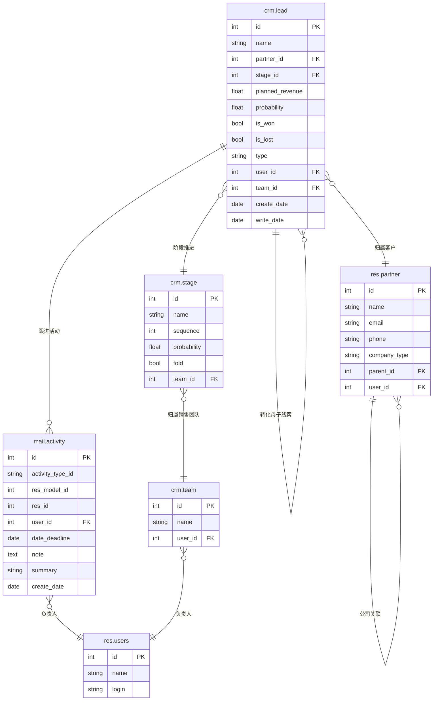

# CRM 数据模型

## ER 关系图

## 核心表字段说明

### crm.lead（线索/机会）

| 字段名 | 类型 | 说明 | 业务含义 |
|--------|------|------|---------|
| id | int | 主键 | 唯一标识 |
| name | char | 名称 | 线索/机会的标题 |
| partner_id | many2one | 客户 | 关联的客户/联系人 |
| stage_id | many2one | 销售阶段 | 当前处于哪个销售阶段 |
| planned_revenue | float | 预计收入 | 预期成交金额 |
| probability | float | 赢单概率(%) | 0-100的概率值 |
| is_won | bool | 是否赢单 | 标记为已成交 |
| is_lost | bool | 是否输单 | 标记为已流失 |
| type | selection | 类型 | lead=线索，opportunity=机会 |
| user_id | many2one | 销售员 | 负责的销售人员 |
| team_id | many2one | 销售团队 | 所属销售团队 |
| create_date | datetime | 创建时间 | 记录创建时间 |

### crm.stage（销售阶段）

| 字段名 | 类型 | 说明 | 业务含义 |
|--------|------|------|---------|
| id | int | 主键 | 唯一标识 |
| name | char | 阶段名称 | 如：新线索→资格认证→提案→谈判→赢单 |
| sequence | int | 顺序号 | 阶段排列顺序 |
| probability | float | 默认概率 | 该阶段的默认赢单概率 |
| fold | bool | 折叠 | 是否在看板中折叠该阶段 |
| team_id | many2one | 销售团队 | 阶段所属的销售团队 |

### res.partner（客户/联系人）

| 字段名 | 类型 | 说明 | 业务含义 |
|--------|------|------|---------|
| id | int | 主键 | 唯一标识 |
| name | char | 名称 | 客户姓名或公司名 |
| email | char | 邮箱 | 电子邮件地址 |
| phone | char | 电话 | 联系电话 |
| company_type | selection | 类型 | person=个人，company=公司 |
| parent_id | many2one | 所属公司 | 关联母公司（个人关联公司时） |
| user_id | many2one | 负责销售 | 负责该客户的销售人员 |

### mail.activity（跟进活动）

| 字段名 | 类型 | 说明 | 业务含义 |
|--------|------|------|---------|
| id | int | 主键 | 唯一标识 |
| activity_type_id | many2one | 活动类型 | 如：电话、邮件、会议、待办 |
| res_model | char | 关联模型 | 如 crm.lead |
| res_id | int | 关联记录 | 关联的具体线索ID |
| user_id | many2one | 负责人 | 负责执行该活动的人 |
| date_deadline | date | 截止日期 | 需要完成该活动的日期 |
| note | text | 备注 | 活动详细说明 |
| summary | char | 摘要 | 活动简述 |

## 业务场景映射

### 线索录入流程

1. **新建线索** → `crm.lead` (type='lead')
   - UI操作：CRM → 线索 → 新建
   - 填写：客户名称、联系方式、来源、备注

2. **线索评分/资格认证** → 更新 `crm.lead.stage_id`
   - 分配到对应销售阶段
   - 记录 `probability`

3. **线索转机会** → `crm.lead` (type='opportunity')
   - UI操作：点击"转为机会"按钮
   - 填写预计收入、成交日期

### 阶段推进流程

- **New → Qualified → Proposal → Negotiation → Won/Lost**
- 每个阶段有对应的 `probability`，影响销售预测
- `fold=true` 的阶段在看板视图中折叠

### 赢单/输单

- `is_won=true` → 标记为赢单，成交金额计入业绩
- `is_lost=true` → 标记为输单，可选择重新激活

### 跟进活动

- 在线索/机会详情页可创建 `mail.activity`
- 设置截止日期和负责人
- 到期提醒销售员跟进
