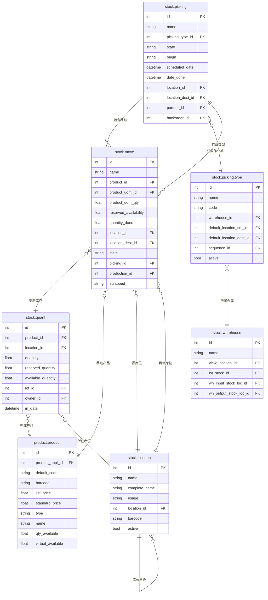

# Inventory 数据模型

## ER 关系图



## 核心表字段说明

### stock.picking（库存作业单）

| 字段名 | 类型 | 说明 | 业务含义 |
|--------|------|------|---------|
| id | int | 主键 | 唯一标识 |
| name | char | 单据号 | 作业单编号（如 WH/IN/00001） |
| picking_type_id | many2one | 作业类型 | incoming/outgoing/internal |
| state | selection | 状态 | draft/assigned/confirmed/done/cancel |
| origin | char | 来源单据 | 关联的销售/采购订单 |
| scheduled_date | datetime | 计划日期 | 预计完成的日期 |
| date_done | datetime | 完成时间 | 实际完成时间 |
| location_id | many2one | 源库位 | 从哪里取货 |
| location_dest_id | many2one | 目标库位 | 货物去向 |
| partner_id | many2one | 合作伙伴 | 供应商/客户 |
| backorder_id | many2one | 后续单 | 部分收货时关联剩余订单 |

### stock.move（库存移动）

| 字段名 | 类型 | 说明 | 业务含义 |
|--------|------|------|---------|
| id | int | 主键 | 唯一标识 |
| name | char | 描述 | 移动描述 |
| product_id | many2one | 产品 | 移动的产品 |
| product_uom_id | many2one | 计量单位 | 单位 |
| product_uom_qty | float | 数量 | 计划移动数量 |
| reserved_availability | float | 已预留 | 已从库存预留的数量 |
| quantity_done | float | 已完成 | 实际完成数量 |
| location_id | many2one | 源库位 | 起始位置 |
| location_dest_id | many2one | 目标库位 | 目标位置 |
| state | selection | 状态 | draft/assigned/confirmed/done/cancel |
| picking_id | many2one | 作业单 | 关联的 stock.picking |
| production_id | many2one | 生产订单 | 关联的生产订单（MRP） |

### stock.quant（实时库存）

| 字段名 | 类型 | 说明 | 业务含义 |
|--------|------|------|---------|
| id | int | 主键 | 唯一标识 |
| product_id | many2one | 产品 | 库存产品 |
| location_id | many2one | 库位 | 所在库位 |
| quantity | float | 数量 | 当前库存数量 |
| reserved_quantity | float | 预留数量 | 被其他单据预留的数量 |
| available_quantity | float | 可用量 | quantity - reserved_quantity |
| lot_id | many2one | 批次号 | 批号/序列号 |
| owner_id | many2one | 所有者 | 货主（支持寄售） |
| in_date | datetime | 入库时间 | 入库时间 |

### stock.location（库位）

| 字段名 | 类型 | 说明 | 业务含义 |
|--------|------|------|---------|
| id | int | 主键 | 唯一标识 |
| name | char | 名称 | 库位名称 |
| complete_name | char | 全路径名 | 如：WH/Stock/Shelf A |
| usage | selection | 类型 | view/supplier/customer/internal/virtual |
| location_id | many2one | 父库位 | 上级库位（构成树形） |
| barcode | char | 条码 | 库位条码 |
| active | bool | 有效 | 是否启用 |

## 业务场景映射

### picking_type 与业务类型映射

| picking_type.code | 业务场景 | location_id | location_dest_id |
|-------------------|---------|-------------|------------------|
| incoming | 采购入库 | 供应商位置（虚拟） | 仓库库位 |
| outgoing | 销售出库 | 仓库库位 | 客户位置（虚拟） |
| internal | 内部调拨 | 源库位 | 目标库位 |

### 双条目记录原则（Double-Entry）

Odoo 库存采用**双条目原则**：每笔库存移动同时记录源库位减少和目标库位增加。

```
销售出库：
  source: Stock（-1） →  stock.move (location_id=Stock)
  dest:   Customer（+1）→  stock.move (location_dest_id=Customer)

采购入库：
  source: Supplier（-1） →  stock.move (location_id=Supplier)
  dest:   Stock（+1） →  stock.move (location_dest_id=Stock)
```

- `stock.quant.quantity` = 所有流入 - 所有流出
- 每次 `stock.move` 完成后，系统自动更新 `stock.quant`

### 库位类型说明

| usage | 说明 | 用途 |
|-------|------|------|
| view | 视图节点 | 组织结构，不存储库存 |
| supplier | 供应商 | 虚拟库位，代表供应商 |
| customer | 客户 | 虚拟库位，代表客户 |
| internal | 内部 | 实际仓库库位 |
| inventory | 盘点 | 虚拟库位，用于库存调整 |
| production | 生产 | 虚拟库位，用于生产投料 |
| transit | 在途 | 跨公司调拨中间库 |

### 库存预留机制

1. 确认销售订单时，系统自动 `reserved_quantity`
2. 出库时 `quantity_done` 更新 `stock.quant`
3. 预留优先于可用库存计算
