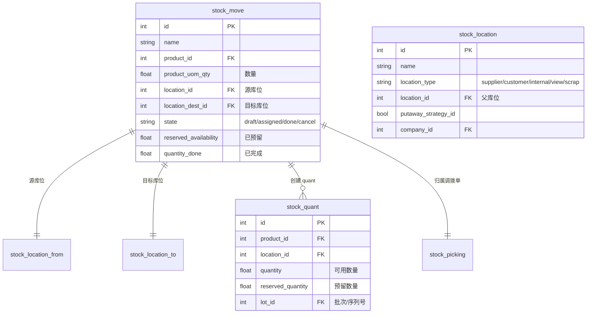
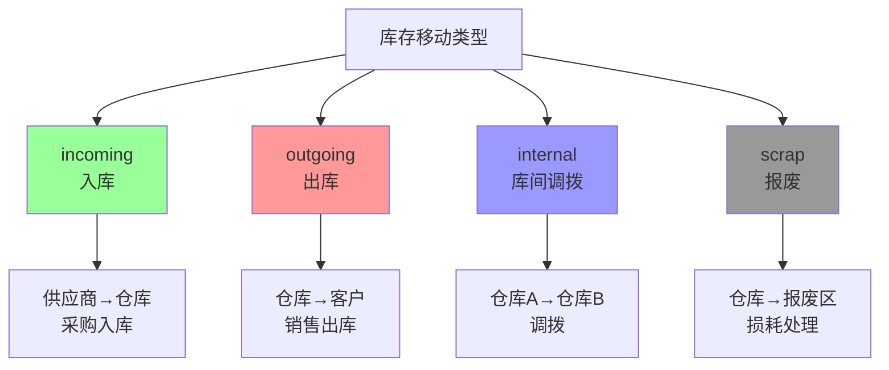
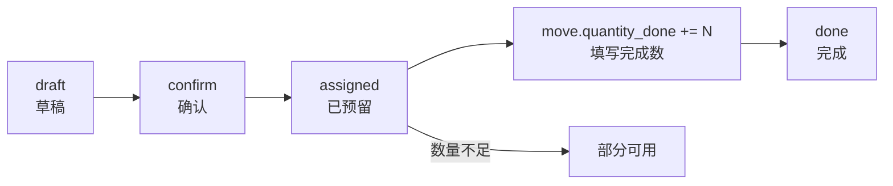

# 库存移动（Stock Moves）

## 库存移动的双条目原则



**双条目原则**: 每一次库存移动，源库位数量减少，目标库位数量增加，通过 `stock.move` 记录这两条边的状态变化。

## 移动类型



| 类型 | picking_type | 方向 | 典型场景 |
|------|-------------|------|---------|
| incoming | vendors | 供应商→仓库 | 采购入库、退货入库 |
| outgoing | customers | 仓库→客户 | 销售出库、退货出库 |
| internal | internal | 仓库→仓库 | 库间调拨、质量检查 |
| scrap | scrap | 仓库→报废 | 损耗、过期 |

## 批次（Lot）和序列号（Serial）追踪

### lot_id vs serial_id

| 字段 | 说明 | 追踪粒度 |
|------|------|---------|
| `lot_id` | 批次号 | 同批次商品共享一个追踪ID |
| `serial_id` | 序列号 | 每个商品唯一序列号 |

```python
# 产品设置
product = env['product.product'].browse(product_id)
product.tracking = 'lot'    # 批次追踪
product.tracking = 'serial'  # 序列号追踪
product.tracking = 'none'    # 不追踪
```

### 批次管理流程

```
采购入库 → 录入/扫描批次号 → 批次入库
   ↓
销售出库 → 指定批次 → 批次出库 → 库存扣减指定批次
   ↓
库存查询 → 按批次查询 → 批次追溯（供应商/日期）
```

### 库存预留与批次

```python
# 出库时选择批次
move_ids.action_assign()
# 系统根据 FIFO 原则选择最早批次
# 也可以手动指定批次

# 序列号全程追踪
# 入库时必须指定 serial
# 出库时系统校验 serial 已入过库
```

## 操作详情 vs 即时转移

### 操作详情（Draft → Done）



**关键状态**:
- `draft`: 创建调拨单，尚未确认
- `confirm`: 确认调拨（源库位检查可用性）
- `assigned`: 库存已预留（reserved_availability = product_uom_qty）
- `done`: 移动完成，quant 更新

### 即时转移（Immediate Transfer）

```
选项: "立即转移" (Immediate Transfer)
含义: 不经过 draft → assigned → done 流程
     直接在确认时完成调拨
效果: 跳过操作详情界面，直接更新 quant

适用场景:
- 快速调拨，不需要逐行确认
- 系统自动填充 quantity_done = product_uom_qty
- 直接 done 状态
```

### 对比

| 维度 | 操作详情模式 | 即时转移 |
|------|-------------|---------|
| 界面 | 有独立的确认→填写→完成步骤 | 直接完成 |
| 灵活性 | 可填写不同数量 | 必须填写完整数量 |
| 批次指定 | 逐行选择批次/序列号 | 无法选择 |
| 适用场景 | 需要复核的调拨 | 快速内部调拨 |
| 状态演变 | draft→assigned→done | draft→done（一步） |

### 操作详情模式示例

```
1. 创建调拨单 (state=draft)
   └─ 添加 move: 产品A x 10, 位置: WH→客户

2. 确认调拨 (state=assigned)
   └─ 系统检查 WH 的 quant 是否 >= 10
   └─ 预留 10 个 (reserved_quantity=10)

3. 仓库人员填写完成数 (quantity_done=8)
   └─ 实际出库 8 个

4. 完成 (state=done)
   └─ 源库位 quant -= 8
   └─ 目标库位 quant += 8
```
