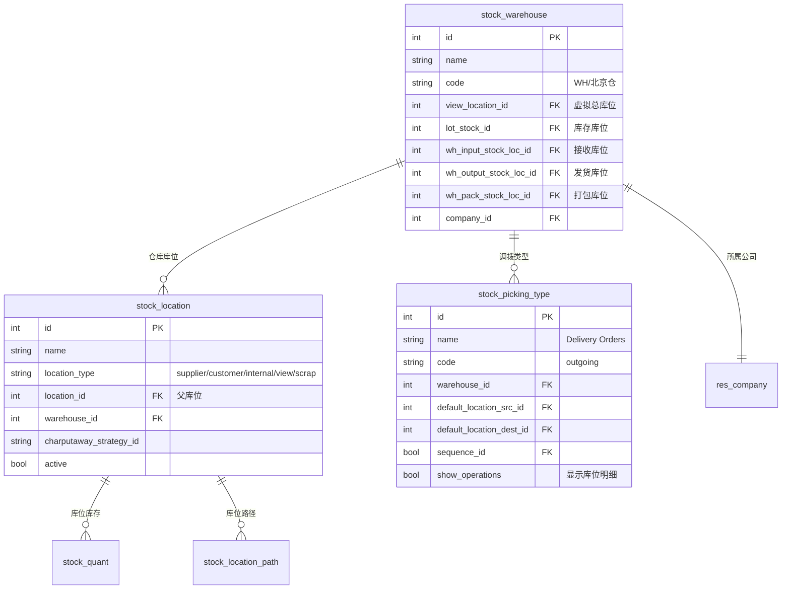
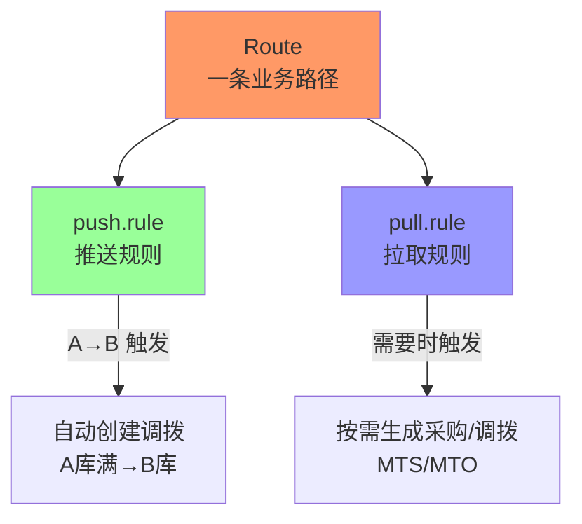
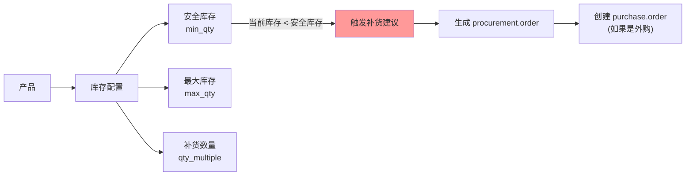
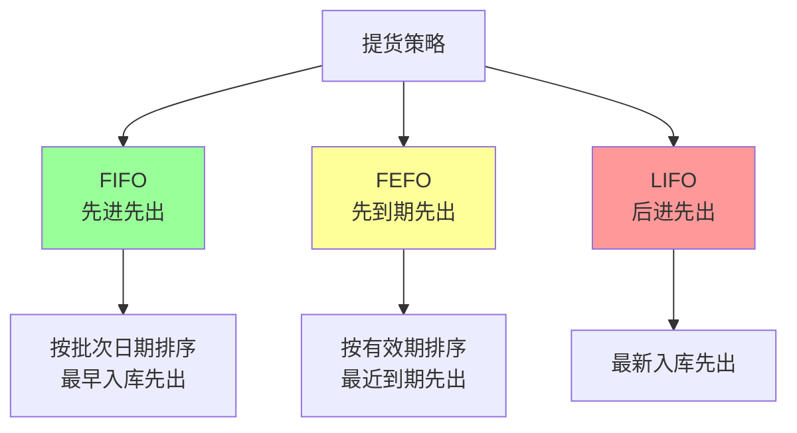

# 仓库配置

## 多仓库配置结构



### 仓库库位层级

```
公司 (res.company)
  │
  └── 仓库 (stock.warehouse)
          │
          ├── 总库位 (view_location_id) - 虚拟，不存商品
          │       │
          │       ├── 库位 (lot_stock_id) - 实际库存点
          │       │       ├── 货架A
          │       │       ├── 货架B
          │       │       └── ...
          │       │
          │       ├── 输入库位 (wh_input_stock_loc_id) - 收货暂存
          │       │       └── ...
          │       │
          │       ├── 输出库位 (wh_output_stock_loc_id) - 发货暂存
          │       │       └── ...
          │       │
          │       └── 打包库位 (wh_pack_stock_loc_id) - 打包区
          │               └── ...
          │
          └── 调拨类型 (stock_picking_type)
                  ├── 收货 (incoming)
                  ├── 发货 (outgoing)
                  └── 内部调拨 (internal)
```

## 路由（Route）和推送/拉取规则

### 路由（Route）概念



### Push Rule（推送规则）

```
触发时机: 库位接收商品时自动触发
典型场景: 
  - 质检完成后自动推到质检库
  - 收货完成后自动推到库存库位
  - 库位库满时推到溢出库位

配置字段:
  - location_from: 触发库位
  - location_dest: 目标库位
  - action: push
  - group_id: 归哪个规则组
```

### Pull Rule（拉取规则）

```
触发时机: 下游需要商品时拉取
典型场景:
  - MTO: 从库存拉到发货准备区
  - MTS: 库存低于安全库存时触发采购
  - 销售订单触发出库拉取

配置字段:
  - location_from: 从哪里拉
  - location_dest: 拉到哪
  - action: pull
  - route_id: 归属路由
  - procure_method: make_to_order / make_to_stock
```

### MTO vs MTS

| 模式 | 全称 | 触发时机 | 流程 |
|------|------|---------|------|
| MTO | Make To Order | 销售订单确认 | 库存→发货准备→客户 |
| MTS | Make To Stock | 安全库存不足 | 采购→入库→库存→客户 |

## 补货规则（Reorder Rules）



### 关键字段

| 字段 | 说明 | 业务含义 |
|------|------|---------|
| `product_id` | 产品 | 哪个产品需要补货 |
| `location_id` | 库位 | 从哪个库位检测 |
| `warehouse_id` | 仓库 | 归属仓库 |
| `min_qty` | 最小库存/安全库存 | 触发补货的阈值 |
| `max_qty` | 最大库存 | 补货目标上限 |
| `qty_multiple` | 补货倍数 | 必须按此数量倍数补货 |
| `procure_uom_id` | 补货单位 | 补货时使用的单位 |

### 补货计算公式

```
补货数量 = max_qty - 当前库存
补货数量 = ceil(补货数量 / qty_multiple) × qty_multiple
```

```python
# 示例
# max_qty=100, min_qty=20, qty_multiple=10
# 当前库存=15
# 补货 = 100 - 15 = 85
# 实际补货 = ceil(85/10) × 10 = 90
```

## 提货策略（FIFO / FEFO / LIFO）



### FIFO（First In First Out）

```
适用场景: 无时效要求的一般商品
原则: 最早入库批次最先出库
Odoo实现:
  - stock.move 的 reserved_availability 按 lot_id.create_date 排序
  - 批次创建日期最早的先分配
```

### FEFO（First Expiry First Out）

```
适用场景: 食品、药品、化妆品等有时效商品
原则: 有效期最近的批次最先出库
Odoo实现:
  - 按 lot_id.expiration_date 排序
  - 出库建议优先分配最快过期的批次
  - 需设置 product.lot 的 use_expiration_date=True
```

### LIFO（Last In First Out）

```
适用场景: 某些库存管理场景（如大宗商品）
原则: 最新入库批次最先出库
注意: Odoo 默认不支持 LIFO，可通过自定义实现
```

### 配置示例

```python
# FEFO 配置（产品级别）
product = env['product.product'].browse(product_id)
product.use_expiration_date = True
product.expiration_time = 365  # 天数
product.removal_strategy_id = strategy_fefo

# FEFO 库位策略
strategy_fefo = env['product.removal'].search([
    ('method', '=', 'fefo')
])
```
