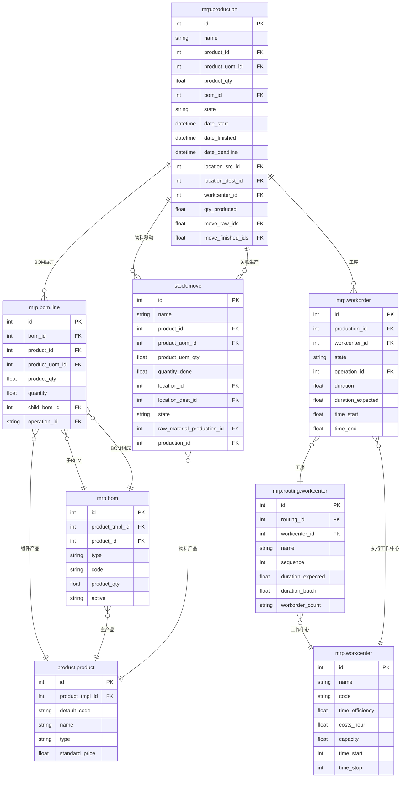

# MRP 生产数据模型

## ER 关系图



## 核心表字段说明

### mrp.production（生产订单）

| 字段名 | 类型 | 说明 | 业务含义 |
|--------|------|------|---------|
| id | int | 主键 | 唯一标识 |
| name | char | 生产单号 | 如：MO/001 |
| product_id | many2one | 产品 | 要生产的成品 |
| product_uom_id | many2one | 单位 | 生产数量单位 |
| product_qty | float | 生产数量 | 计划生产数量 |
| bom_id | many2one | 物料清单 | 关联的BOM |
| state | selection | 状态 | draft/confirmed/progress/to_close/done/cancel |
| date_start | datetime | 开始时间 | 计划/实际开始时间 |
| date_finished | datetime | 完成时间 | 计划/实际完成时间 |
| date_deadline | datetime | 截止日期 | 交货截止日期 |
| location_src_id | many2one | 原料库位 | 投料仓库 |
| location_dest_id | many2one | 成品库位 | 成品入库仓库 |
| qty_produced | float | 已完成数量 | 实际生产数量 |

### mrp.bom（物料清单）

| 字段名 | 类型 | 说明 | 业务含义 |
|--------|------|------|---------|
| id | int | 主键 | 唯一标识 |
| product_tmpl_id | many2one | 产品模板 | BOM所属的产品模板 |
| product_id | many2one | 产品变体 | 特定变体的BOM（可选） |
| type | selection | BOM类型 | normal=标准, phantom=套件 |
| code | char | 编码 | BOM编号 |
| product_qty | float | 产品数量 | BOM对应的产成品数量（通常为1） |
| active | bool | 有效 | 是否启用 |

### mrp.bom.line（BOM组件行）

| 字段名 | 类型 | 说明 | 业务含义 |
|--------|------|------|---------|
| id | int | 主键 | 唯一标识 |
| bom_id | many2one | 所属BOM | 关联的 mrp.bom |
| product_id | many2one | 组件产品 | 需要用到的物料/组件 |
| product_uom_id | many2one | 单位 | 计量单位 |
| product_qty | float | 数量 | 单位产品需要的组件数量 |
| child_bom_id | many2one | 子BOM | 如果是半成品，关联其BOM（嵌套） |
| sequence | int | 顺序 | 组件顺序 |

### mrp.workcenter（工作中心）

| 字段名 | 类型 | 说明 | 业务含义 |
|--------|------|------|---------|
| id | int | 主键 | 唯一标识 |
| name | char | 名称 | 工作中心名称 |
| code | char | 代码 | 工作中心编号 |
| time_efficiency | float | 时间效率 | 效率系数（百分比） |
| costs_hour | float | 单位小时成本 | 每小时加工成本 |
| capacity | float | 产能 | 同时可加工的产品数 |
| time_start | int | 准备时间 | 准备时间（分钟） |
| time_stop | int | 结束时间 | 结束时间（分钟） |

### mrp.routing.workcenter（工艺路线工序）

| 字段名 | 类型 | 说明 | 业务含义 |
|--------|------|------|---------|
| id | int | 主键 | 唯一标识 |
| routing_id | many2one | 工艺路线 | 所属工艺路线 |
| workcenter_id | many2one | 工作中心 | 执行该工序的工作中心 |
| name | char | 工序名称 | 如：切割、焊接、喷涂 |
| sequence | int | 顺序号 | 工序排列顺序 |
| duration_expected | int | 预计时长 | 标准加工时长（分钟） |
| duration_batch | int | 批量时长 | 批量加工时长（分钟） |

### stock.move（生产相关库存移动）

| 字段名 | 类型 | 说明 | 业务含义 |
|--------|------|------|---------|
| id | int | 主键 | 唯一标识 |
| product_id | many2one | 产品 | 物料/成品 |
| product_uom_qty | float | 数量 | 计划移动数量 |
| quantity_done | float | 已完成数量 | 实际消耗/产出数量 |
| location_id | many2one | 源库位 | 原料库位（领料）/工序库位 |
| location_dest_id | many2one | 目标库位 | 工序库位/成品库位 |
| state | selection | 状态 | draft/assigned/confirmed/done/cancel |
| raw_material_production_id | many2one | 投料单 | 关联的生产订单（领料） |
| production_id | many2one | 生产订单 | 关联的生产订单（入库） |

## 业务场景映射

### 生产订单状态机

```
draft（草稿）→ confirmed（已确认）→ progress（生产中）→ to_close（待完工）→ done（完成）
                                                                              ↘ cancel（取消）
```

### 生产流程详解

#### 1. 创建生产订单
- UI操作：生产 → 制造订单 → 新建
- 选择产品、数量、BOM
- 系统自动展开 BOM 生成 `stock.move`（投料）

#### 2. BOM 展开（Explosion）
- 根据 `mrp.bom` 和 `mrp.bom.line` 自动生成投料清单
- 每条 `mrp.bom.line` → 一条 `stock.move` (raw_material_production_id)
- 支持嵌套 BOM：`child_bom_id` 递归展开

#### 3. 领料（Consume）
- UI操作：点击"确认"后，生成待领料清单
- `stock.move.location_id` = 生产库位
- `stock.move.location_dest_id` = 在制品库位（Production）
- 实际领料后 `quantity_done` 更新

#### 4. 工序执行（Workorders）
- 如果 BOM 关联工艺路线，生成 `mrp.workorder`
- 每个工序对应 `mrp.routing.workcenter` 的一条记录
- 工序完成后更新 `duration` 和 `state`

#### 5. 完工入库
- 最后一个工序完成后，点击"完工入库"
- `stock.move` (production_id) → 产成品入库
- 更新 `mrp.production.qty_produced`

### 双库存记录

| 类型 | stock.move | 说明 |
|------|-----------|------|
| 投料 | location_id=Stock, location_dest_id=Production | 原料从仓库转入生产 |
| 产出 | location_id=Production, location_dest_id=Stock | 成品从生产转入仓库 |
| 报废 | location_id=Production, location_dest_id=Scrap | 不良品的报废 |

### 成本计算

- **人工成本** = Σ(工序.duration × 工作中心.costs_hour × 时间效率)
- **物料成本** = Σ(投料.quantity_done × product.standard_price)
- **总成本** = 人工成本 + 物料成本 + 间接费用
