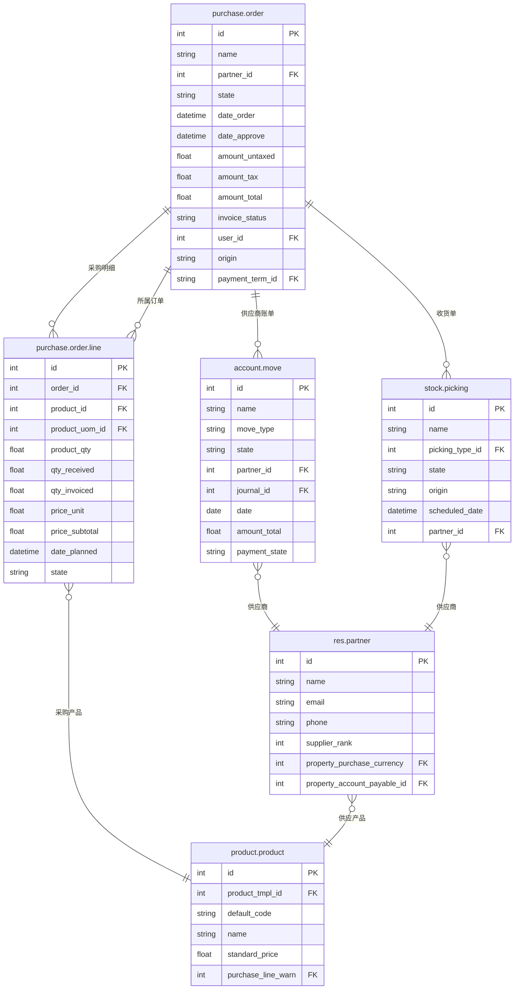

# Purchase 数据模型

## ER 关系图



## 核心表字段说明

### purchase.order（采购订单）

| 字段名 | 类型 | 说明 | 业务含义 |
|--------|------|------|---------|
| id | int | 主键 | 唯一标识 |
| name | char | 订单号 | 采购订单编号（如 PO/001） |
| partner_id | many2one | 供应商 | 供应商/ vendor |
| state | selection | 状态 | draft/sent/purchase/done/cancel |
| date_order | datetime | 订购日期 | 下单日期 |
| date_approve | datetime | 审批日期 | 订单审批通过日期 |
| amount_untaxed | float | 未税金额 | 商品小计 |
| amount_tax | float | 税额 | 税额合计 |
| amount_total | float | 总金额 | 含税总金额 |
| invoice_status | selection | 开票状态 | no/to invoice/invoiced |
| user_id | many2one | 采购员 | 负责该订单的采购人员 |
| origin | char | 来源 | 关联的需求请购单 |
| payment_term_id | many2one | 付款条款 | 如：30天、60天 |

### purchase.order.line（采购行）

| 字段名 | 类型 | 说明 | 业务含义 |
|--------|------|------|---------|
| id | int | 主键 | 唯一标识 |
| order_id | many2one | 所属订单 | 关联的 purchase.order |
| product_id | many2one | 产品 | 采购的产品 |
| product_uom_id | many2one | 计量单位 | 采购单位 |
| product_qty | float | 订购数量 | 计划采购数量 |
| qty_received | float | 已收货 | 已入库数量 |
| qty_invoiced | float | 已开票 | 已生成发票数量 |
| price_unit | float | 单价 | 采购单价 |
| price_subtotal | float | 小计 | 未税小计 |
| date_planned | datetime | 计划到货日 | 预计到货日期 |
| state | selection | 状态 | draft/purchase/done/cancel |

### res.partner（供应商）

| 字段名 | 类型 | 说明 | 业务含义 |
|--------|------|------|---------|
| id | int | 主键 | 唯一标识 |
| name | char | 名称 | 供应商名称 |
| supplier_rank | int | 供应商等级 | 数值越大优先级越高 |
| property_purchase_currency | many2one | 采购币种 | 该供应商偏好的采购币种 |
| property_account_payable_id | many2one | 应付账款科目 | 应付账款的会计科目 |
| email | char | 邮箱 | 联系方式 |
| phone | char | 电话 | 联系方式 |

### account.move（供应商账单，in_invoice）

| 字段名 | 类型 | 说明 | 业务含义 |
|--------|------|------|---------|
| id | int | 主键 | 唯一标识 |
| name | char | 账单号 | 发票编号 |
| move_type | selection | 类型 | in_invoice/vendor bill |
| state | selection | 状态 | draft/posted/cancelled |
| partner_id | many2one | 供应商 | 开票供应商 |
| journal_id | many2one | 日记账 | 关联的日记账 |
| date | date | 账单日期 | 发票日期 |
| amount_total | float | 总金额 | 含税金额 |
| payment_state | selection | 付款状态 | not_paid/partial/paid |

## 业务场景映射

### 三单匹配（Three-way matching）

```
PO（采购订单）→ Receipt（收货单）→ Vendor Bill（供应商账单）
```

| 阶段 | 单据 | 关联字段 | 业务含义 |
|------|------|---------|---------|
| 下单 | purchase.order | - | 向供应商发出采购请求 |
| 收货 | stock.picking | origin=PO.name | 仓库实际收货入库 |
| 开票 | account.move | line.purchase_line_id | 收到供应商发票后入账 |

### 三单匹配核销规则

| 匹配状态 | 说明 |
|---------|------|
| `qty_received = qty_invoiced` | 完全匹配，正常入账 |
| `qty_received < qty_invoiced` | 超收/超开，需调查 |
| `qty_received > qty_invoiced` | 部分收货，剩余待收 |

### 订单状态机

```
draft（草稿）→ sent（已发送）→ purchase（已确认）→ done（完成）
                                                ↘ cancel（取消）
```

1. **创建采购申请** → `purchase.order` (state='draft')
   - UI操作：采购 → 采购订单 → 新建
   - 选择供应商、产品、数量、交期

2. **发送订单** → `purchase.order` (state='sent')
   - UI操作：点击"发送订单"按钮
   - 可通过邮件发送给供应商

3. **确认订单** → `purchase.order` (state='purchase')
   - UI操作：点击"确认订单"按钮
   - 订单锁定，生成待收货

4. **收货入库** → `stock.picking` (picking_type='incoming')
   - UI操作：采购 → 收货 → 确认入库
   - 系统更新 `purchase.order.line.qty_received`

5. **创建供应商账单** → `account.move` (move_type='in_invoice')
   - UI操作：采购 → 供应商账单 → 创建
   - 可从 PO 关联创建，自动带出采购明细

6. **付款** → `account.payment`
   - UI操作：会计 → 付款 → 登记付款
   - 核销应付账款
