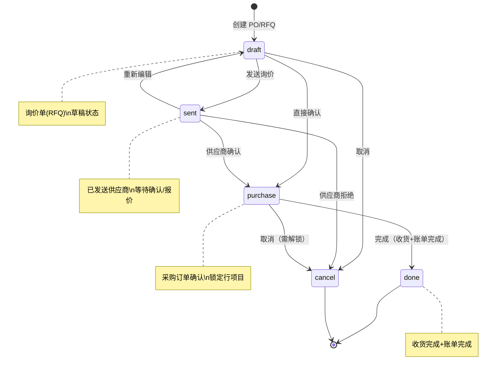
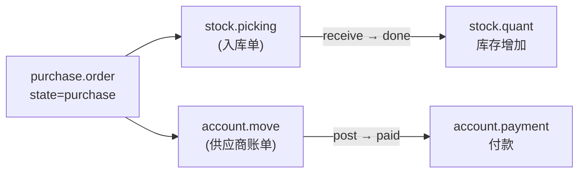
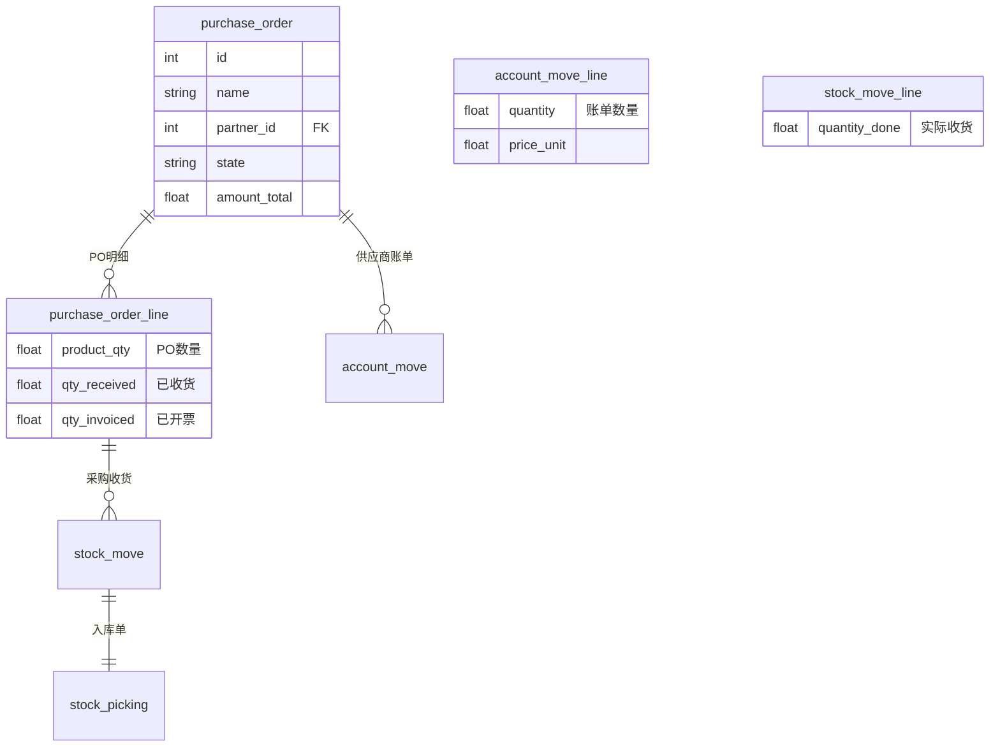

# 采购订单工作流

## 采购流程状态机



## 询价单（RFQ）→ 采购订单（PO）转化

### 两种模式

| 场景 | 操作 | 结果 |
|------|------|------|
| 直接采购 | 创建时即选择供应商 | draft → purchase（跳过 sent） |
| 询价采购 | 创建后发送询价 | draft → sent → purchase |

### 发送询价单

```python
# RFQ 发送询价
purchase_order.action_rfq_send()
# 效果:
# 1. state: draft → sent
# 2. 生成邮件草稿
# 3. 等待供应商确认
```

### 确认采购订单

```python
# 供应商确认后，销售员点击「确认订单」
purchase_order.button_confirm()
# 效果:
# 1. state: sent/draft → purchase
# 2. 锁定订单行
# 3. 触发采购申请/采购生成
```

### 订单确认后自动创建



## 三单匹配（PO + 收货单 + 供应商账单）核对逻辑



### 匹配原则

```
三单关系:
  PO (qty_ordered) → 采购计划数量
  Picking (qty_received) → 实际入库数量
  Invoice (qty_invoiced) → 供应商账单数量

理想状态: ordered = received = invoiced
```

### 核对规则

| 状态 | 含义 | 处理方式 |
|------|------|---------|
| `ordered > received` | 部分到货 | 等待供应商继续发货 |
| `ordered = received > invoiced` | 已收货未开票 | 等待供应商开票 |
| `ordered = received = invoiced` | 三单匹配 | 正常完成 |
| `invoiced > received` | 超收账单 | ⚠️ 需审核，供应商多收钱 |
| `received > ordered` | 超量到货 | ⚠️ 需确认，多收了货 |

### 账单匹配界面

```python
# Odoo 采购模块提供 bills matching 视图
# 显示: 采购行 / 收货数量 / 开票数量 / 差异

# 可通过以下操作进行匹配
purchase_bill.unreconcile()   # 取消匹配
purchase_bill.auto_reconcile()  # 自动匹配
```

### 差异处理

```python
# 超开账单 → 拒绝或部分入账
# 超量收货 → 退回调拨或接受（需更新PO）

# 部分收货开票
invoice_line = [(0, 0, {
    'product_id': line.product_id.id,
    'quantity': line.qty_received,  # 按实际收货开票
    'price_unit': line.price_unit,
})]
```

### 三单完整流程

```
1. 创建 PO (draft)
   └─ pol: 产品A x 100件, 单价 10元

2. 发送询价 (draft → sent)
   └─ 邮件发送供应商

3. 供应商确认 (sent → purchase)
   └─ PO 锁定

4. 供应商发货，仓库收货
   └─ picking: 产品A x 80件
   └─ 第一次收货 done: qty_received=80

5. 供应商开票
   └─ invoice: 产品A x 80件, 单价 10元
   └─ 财务核对: ordered=100, received=80, invoiced=80
   └─ 正常过账

6. 剩余 20 件到货
   └─ picking: 产品A x 20件
   └─ 第二次收货 done: qty_received=20
   └─ ordered=100, received=100

7. 供应商补开剩余 20 件账单
   └─ invoice: 产品A x 20件
   └─ matched: ordered=100, received=100, invoiced=100

8. 付款完成 → PO done
```
