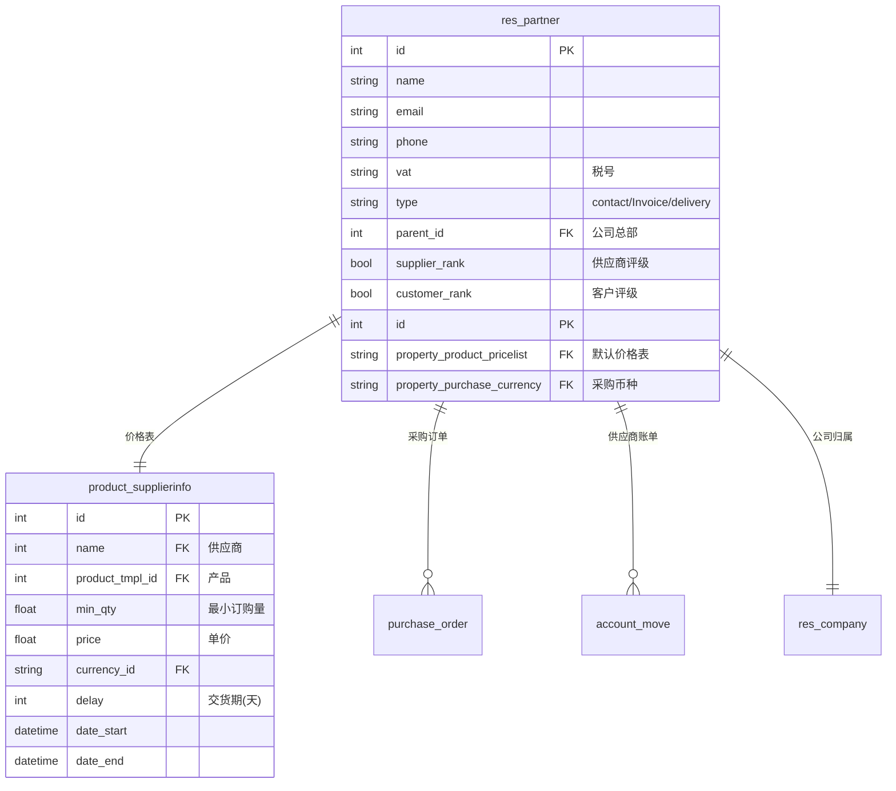
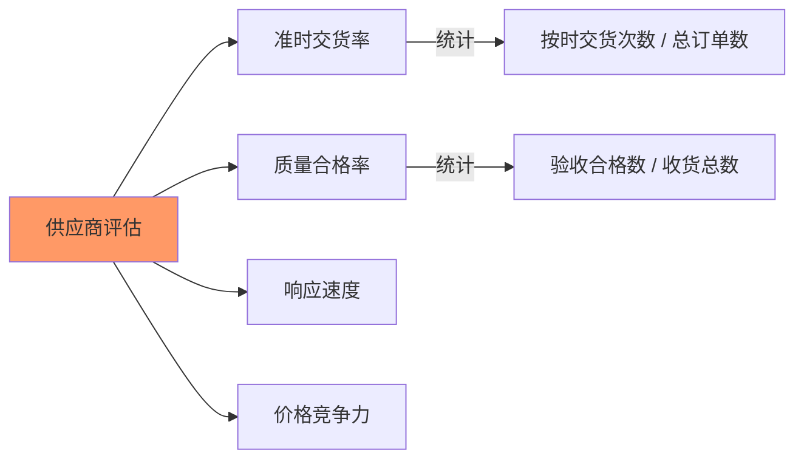

# 供应商管理

## 供应商档案关键字段

### 供应商主档（res.partner）



### 核心字段说明

| 字段 | 说明 | 业务含义 |
|------|------|---------|
| `name` | 供应商名称 | 商业名称 |
| `email` | 邮箱 | 发送询价单地址 |
| `phone` | 电话 | 联系方式 |
| `vat` | 税号/增值税号 | 税务登记 |
| `supplier_rank` | 供应商标识 | 值>0表示是供应商 |
| `customer_rank` | 客户标识 | 值>0表示是客户 |
| `property_product_pricelist` | 默认采购价格表 | 采购时的参考价 |
| `property_purchase_currency` | 采购币种 | 采购结算货币 |

### 供应商地址子类型

| 类型 | 说明 | 用途 |
|------|------|------|
| `contact` | 主体联系 | 供应商主档案 |
| `invoice` | 发票地址 | 账单/发票抬头 |
| `delivery` | 交货地址 | 收货仓库 |
| `other` | 其他 | 备选联系 |

## 供应商价格表配置

### 产品级供应商信息

```python
# 采购模块: 产品 → 供应商信息
product_tmpl = env['product.template'].browse(tmpl_id)
supplier_info = product_tmpl.seller_ids

# seller_ids 字段 (product.supplierinfo)
# - name: 供应商（res.partner）
# - product_name: 供应商产品名称
# - product_code: 供应商产品编码
# - min_qty: 最小订购量
# - price: 单价
# - currency_id: 币种
# - delay: 交货期天数
```

### 多供应商优先级

```
同一产品可能有多个供应商seller_ids

优先级排序:
1. 最低价优先 (price 最低)
2. 最小交货期优先 (delay 最少)
3. 最小订购量限制 (min_qty)

采购时选择逻辑:
- 采购产品时，自动选择满足数量要求的最低价供应商
- 采购员可手动覆盖选择
```

### 供应商价格表示例

```python
# 为产品配置多供应商
product = env['product.product'].browse(product_id)

# 供应商A: 批量价
seller_A = env['product.supplierinfo'].create({
    'name': supplier_A_id,
    'product_tmpl_id': product.product_tmpl_id.id,
    'min_qty': 1,
    'price': 12.00,
    'delay': 7,
})

# 供应商B: 批发价（量大优惠）
seller_B = env['product.supplierinfo'].create({
    'name': supplier_B_id,
    'product_tmpl_id': product.product_tmpl_id.id,
    'min_qty': 100,
    'price': 10.00,
    'delay': 14,
})
```

## 交货期设置

### 关键字段

| 字段 | 说明 | 单位 |
|------|------|------|
| `delay` | 交货提前期 | 天 |
| `min_delay` | 最小交货天数 | 天 |
| `max_delay` | 最大交货天数 | 天 |

### 采购计划日期计算

```
订单确认日期 → 自动计算计划交货日期

计划日期 = 确认日期 + delay

示例:
  - 订单确认: 2026-04-15
  - 供应商 delay: 7 天
  - 计划交货: 2026-04-22
```

### 采购员交货期配置

```python
# res.partner 上设置默认交货期
partner = env['res.partner'].browse(supplier_id)
# 默认采购交货天数（在采购设置中）
# purchase.plan.delivery_days = 7
```

## 供应商评估字段

### 供应商绩效



### Odoo 标准评估字段

| 字段 | 模型 | 说明 |
|------|------|------|
| `picking_warn` | `res.partner` | 收货警告级别 |
| `picking_warn_msg` | `res.partner` | 警告消息 |
| `supplier_rank` | `res.partner` | 供应商评级 |
| `delivered_low_score` | `product.supplierinfo` | 交货评分（自定） |
| `quality_score` | `product.supplierinfo` | 质量评分（自定） |

### 自定义评估指标

```python
# 可通过采购报告自定义评估

# 评估报告维度:
# - 供应商名称
# - 总订单数
# - 准时交货率 (stock.picking done_date vs scheduled_date)
# - 平均价格 vs 市场价
# - 质量投诉次数
# - 响应时间 (询价→报价)
```

### 供应商绩效视图

```python
# 采购分析报表
report = env['purchase.report'].read_group(
    [('partner_id', '=', supplier_id)],
    ['purchased_qty', 'price_avg', 'delay'],
    ['partner_id']
)
# 生成:
# - 平均采购价格
# - 平均交货天数
# - 采购总量
```
