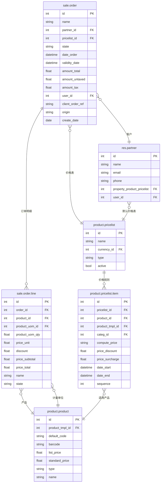

# Sales 数据模型

## ER 关系图



## 核心表字段说明

### sale.order（销售订单/报价单）

| 字段名 | 类型 | 说明 | 业务含义 |
|--------|------|------|---------|
| id | int | 主键 | 唯一标识 |
| name | char | 订单号 | 报价单/订单编号（如 SO/001） |
| partner_id | many2one | 客户 | 订购的客户 |
| pricelist_id | many2one | 价格表 | 使用的价格表 |
| state | selection | 状态 | draft/sent/sale/done/cancel |
| date_order | datetime | 订单日期 | 订单创建/确认日期 |
| validity_date | date | 有效期 | 报价的有效期截止日 |
| amount_untaxed | float | 未税金额 | 商品小计 |
| amount_tax | float | 税额 | 税额合计 |
| amount_total | float | 总金额 | 含税总金额 |
| user_id | many2one | 销售员 | 负责该订单的销售人员 |
| client_order_ref | char | 客户参考号 | 客户方的订单号 |
| origin | char | 来源单据 | 关联的合同/预估订单 |

### sale.order.line（订单行）

| 字段名 | 类型 | 说明 | 业务含义 |
|--------|------|------|---------|
| id | int | 主键 | 唯一标识 |
| order_id | many2one | 所属订单 | 关联的 sale.order |
| product_id | many2one | 产品 | 销售的产品 |
| product_uom_id | many2one | 计量单位 | 销售单位（如 件、箱） |
| product_uom_qty | float | 数量 | 订购数量 |
| price_unit | float | 单价 | 单价（含税/未税视配置） |
| discount | float | 折扣(%) | 手动折扣比例 |
| price_subtotal | float | 小计 | 未税小计 = qty × price × (1-discount) |
| price_total | float | 含税小计 | 含税小计 |
| name | text | 描述 | 产品描述/规格说明 |

### product.pricelist（价格表）

| 字段名 | 类型 | 说明 | 业务含义 |
|--------|------|------|---------|
| id | int | 主键 | 唯一标识 |
| name | char | 名称 | 价格表名称 |
| currency_id | many2one | 货币 | 价格表适用的币种 |
| type | selection | 类型 | sale=销售价，purchase=采购价 |
| active | bool | 有效 | 是否启用 |

### product.pricelist.item（价格规则）

| 字段名 | 类型 | 说明 | 业务含义 |
|--------|------|------|---------|
| id | int | 主键 | 唯一标识 |
| pricelist_id | many2one | 所属价格表 | 关联价格表 |
| product_id | many2one | 适用产品 | 精确到某个产品变体 |
| product_tmpl_id | many2one | 产品模板 | 适用于某产品模板的所有变体 |
| categ_id | many2one | 产品分类 | 适用于某个产品分类 |
| compute_price | selection | 计算方式 | fixed/percentage/formula/pricelist |
| price_discount | float | 折扣率 | 基于列表价的折扣 |
| price_surcharge | float | 价格附加 | 固定价格附加 |
| date_start | datetime | 开始日期 | 规则生效开始时间 |
| date_end | datetime | 结束日期 | 规则生效结束时间 |
| sequence | int | 优先级 | 规则优先级（越小越优先） |

## 业务场景映射

### 报价 → 订单流程

```
draft（草稿）→ sent（已发送）→ sale（已确认）→ done（完成）
                                              ↘ cancel（取消）
```

1. **创建报价单** → `sale.order` (state='draft')
   - UI操作：销售 → 报价单 → 新建
   - 选择客户、产品、数量
   - 系统根据 `pricelist_id` 自动计算价格

2. **发送报价** → `sale.order` (state='sent')
   - UI操作：点击"发送报价"按钮
   - 可通过邮件发送给客户

3. **确认订单** → `sale.order` (state='sale')
   - UI操作：点击"确认订单"按钮
   - 锁定价格，生成后续出库/发票

4. **生成交货单** → 创建 `stock.picking` (outgoing)
   - UI操作：点击"创建交货单"按钮
   - 根据订单行生成待出库产品

5. **生成发票** → 创建 `account.move` (out_invoice)
   - UI操作：点击"创建发票"按钮
   - 可选择"发票登记"或"发送发票"

### 价格表应用规则

- `compute_price='percentage'`：列表价 × (1 - discount)
- `compute_price='fixed'`：固定价格
- `compute_price='formula'`：公式计算（基础价±调整）
- 优先级：产品 > 产品分类 > 全局
- 按 `date_start/date_end` 控制有效期
