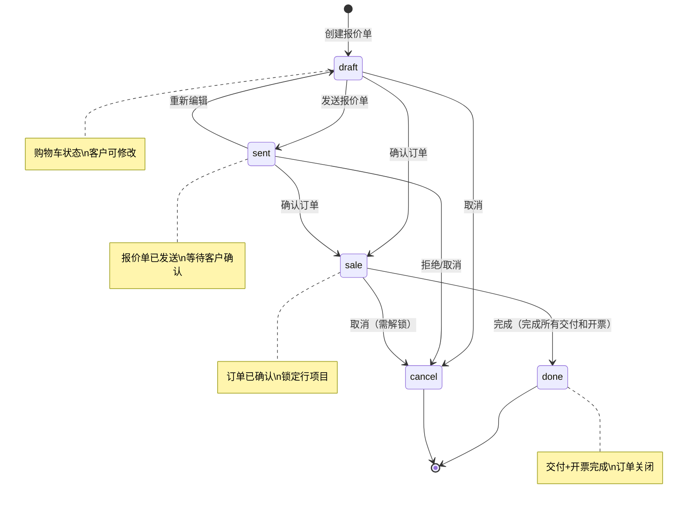
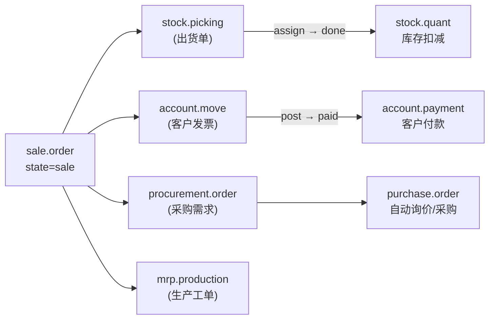

# 销售订单工作流

## 销售报价单完整状态机



## 各状态可执行操作

### draft（草稿/购物车）

| 操作 | 说明 |
|------|------|
| `action_draft` | 重置为草稿 |
| `action_confirm` | 确认报价 → sale |
| `action_cancel` | 取消订单 |
| 添加/删除行 | 修改产品明细 |
| 更新数量 | 调整采购数量 |
| 应用价格表 | 重新计算价格 |

### sent（已发送报价）

| 操作 | 说明 |
|------|------|
| `action_confirm` | 确认订单 → sale |
| `action_cancel` | 取消订单 |
| `action_draft` | 退回草稿重新编辑 |
| `action_quotation_send` | 重新发送邮件 |

### sale（销售订单）

| 操作 | 说明 |
|------|------|
| `action_done` | 标记完成（需所有交付/发票完成） |
| `action_cancel` | 取消订单（会生成反向凭证） |
| `print_order` | 打印订单 |
| `action_quotation_send` | 发送确认邮件 |
| `锁定行项目` | 禁止直接修改明细 |

### done（完成）

| 操作 | 说明 |
|------|------|
| `action_unlock` | 解锁后可修改 → sale |

### cancel（已取消）

| 操作 | 说明 |
|------|------|
| `action_draft` | 恢复为草稿重新开始 |

## 确认订单后自动触发的下游操作



### 1. 交货单（stock.picking）

```
触发时机: sale.order 确认时自动创建
状态演变: draft → waiting → confirmed → assigned → done
操作详情: 
  - warehouse_id: 从订单的 warehouse_id 取
  - picking_type_id: outgoing（销售出货）
  - origin: sale_order.name（关联来源订单）
```

```python
# 关键字段
sale_order.action_confirm()
# 自动执行:
# 1. sol.procurement_ids 生成
# 2. stock.picking 创建（state='draft'）
# 3. procurement.order 触发采购/生产
```

### 2. 客户发票（account.move）

**两种生成模式**:

| 模式 | 说明 | 触发 |
|------|------|------|
| 发票前置 | 订单确认时立即生成发票 | `automatic_invoice=True` |
| 手动开票 | 按需点击「创建发票」按钮 | 手动 |

```python
# 创建发票
sale_order._create_invoices()
# 生成 account.move (type=out_invoice)
# 状态: draft → posted(过账) → paid(收款)
```

**发票行与订单行对应**:
```
sale.order.line (id=5) → account.move.line (name=产品A, quantity=2, price_unit=100)
```

### 3. 采购需求（procurement.order）

当产品 type=product 且 `procurement_jit=True` 时：
```
销售订单行 → 生成 procurement.order → 自动触发采购/生产
```

### 4. 生产工单（mrp.production）

当产品设置 `type=product` + `supply_method='produce'`：
```
销售订单行 → 生成 mrp.production → 生产 → 入库
```

### 完整流程示例

```
1. 销售员创建 sale.order (draft)
   └─ 添加 sale.order.line: 产品A x 10

2. 发送报价单 (draft → sent)
   └─ 邮件发送至客户

3. 客户确认，销售员点击「确认」 (sent → sale)
   └─ 自动创建 stock.picking (draft, outgoing)
   └─ 自动创建 account.move (draft, out_invoice)
   └─ 自动创建 procurement.order

4. 仓库确认备货 (picking: draft → assigned → done)
   └─ stock.quant 数量减少

5. 财务开票过账 (move: draft → posted)
   └─ 应收金额更新

6. 客户付款 (move: posted → paid)
   └─ 核销应收账款

7. 订单全部完成后 (sale → done)
   └─ 所有 picking done 且所有 invoice paid
```
