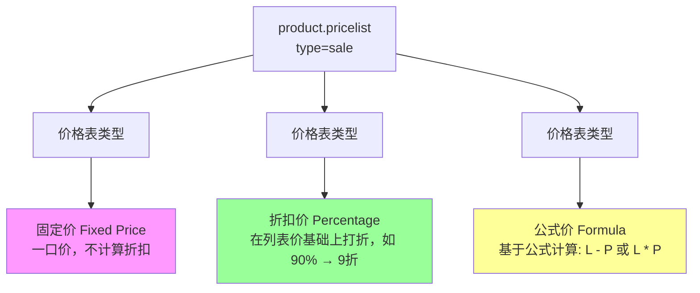
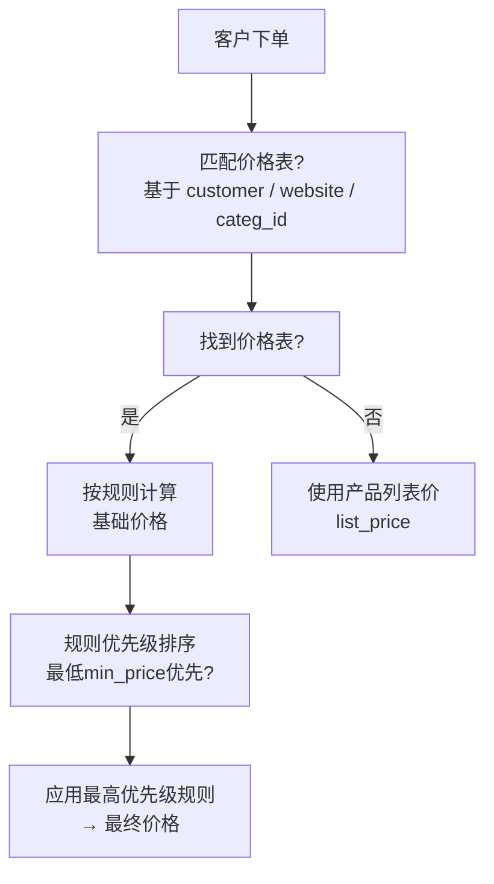
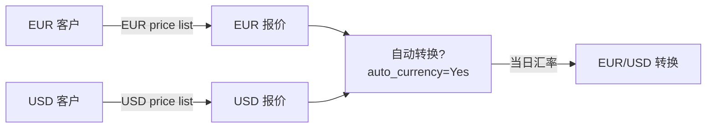

# 价格表（Pricelist）配置

## 价格表类型



### 1. 固定价（Fixed Price）

```
场景: 特殊客户专享价，不受产品列表价影响
配置: 价格 = 固定金额
示例: 产品A对VIP客户永远卖 88.00
```

### 2. 折扣价（Percentage）

```
场景: 全场统一折扣，如会员95折
配置: 价格 = 列表价 × (1 - discount_percent)
示例: discount=10% → 9折销售
```

### 3. 公式价（Formula）

```
场景: 复杂定价策略，如成本加成、竞争对手价格匹配
配置选项:
  - L: 产品列表价（list_price）
  - P: 折扣百分比 (0-1)
  - PS: 产品标准成本价 (standard_price)
  
公式: L * (1 - P)    → 百分比折扣
公式: L - P          → 固定金额折扣
公式: PS * (1 + P)   → 成本加成定价
```

## 价格规则优先级



### 优先级规则

| 维度 | 说明 |
|------|------|
| 客户专属价格 | 最高（customer_id 精确匹配） |
| 分类价格 | 中（categ_id 精确匹配） |
| 产品价格 | 中（product_id 精确匹配） |
| 通用价格 | 低（未指定任何条件） |

```python
# 价格计算顺序
# 1. 匹配 customer + product → 客户专属价
# 2. 匹配 categ_id + product → 分类价
# 3. 匹配 product → 产品级价格
# 4. 匹配通用规则 → 兜底
# 5. 无规则 → 产品 list_price
```

### 价格规则字段

| 字段 | 说明 |
|------|------|
| `pricelist_id` | 归属的价格表 |
| `categ_id` | 匹配产品分类（空=所有分类） |
| `product_tmpl_id` | 匹配产品模板（空=所有） |
| `product_id` | 匹配具体变体（空=模板级） |
| `min_quantity` | 最小起订量 |
| `applied_on` | 应用对象：3-全局/2-分类/1-产品/0-变体 |
| `compute_price` | 计算方式：fixed/percentage/formula |
| `fixed_price` | 固定价格（compute_price=fixed） |
| `percent_price` | 折扣率（compute_price=percentage） |
| `base` | 价格基准（compute_price=formula） |
| `base_pricelist_id` | 基准价格表 |
| `price_discount` | 折扣值（公式中 P） |
| `price_surcharge` | 附加费 |

## 多货币配置



### 配置要点

| 设置项 | 说明 |
|--------|------|
| `currency_id` | 价格表货币（EUR/USD/CNY...） |
| `auto_currency` | 自动按汇率转换（17.0+） |
| 汇率来源 | Odoo 汇率模块自动更新 |

```python
# 多货币价格表配置
pricelist_eur = {
    'name': 'EU Customer Price List (EUR)',
    'currency_id': eur_id,
    'company_id': company_id,
}

pricelist_usd = {
    'name': 'US Customer Price List (USD)',
    'currency_id': usd_id,
    'company_id': company_id,
}
```

## 代码示例：应用价格表查询报价

### Python ORM 方式

```python
# 获取客户适用的价格表
partner = env['res.partner'].browse(partner_id)
pricelist_id = partner.property_product_pricelist.id

# 通过价格表计算产品单价
pricelist = env['product.pricelist'].browse(pricelist_id)

# 单产品价格计算
price = pricelist.get_product_price(
    product, 
    quantity=10, 
    partner=partner
)

# 通过价格表规则计算（底层）
# 相当于 sale.order 上的价格计算逻辑
```

### XML-RPC 调用示例

```python
import xmlrpc.client

# 连接
common = xmlrpc.client.ServerProxy('{}/xmlrpc/2/common'.format(url))
uid = common.authenticate(db, user, password, {})

# 获取价格
models = xmlrpc.client.ServerProxy('{}/xmlrpc/2/object'.format(url))

# 调用 product.pricelist 的 price_compute 方法
price = models.execute_kw(
    db, uid, password,
    'product.pricelist', 'price_get',
    [pricelist_id, product_id, qty, partner_id],
    {'context': {'quantity': qty, 'partner_id': partner_id}}
)
# Returns: {pricelist_id: 85.50}
```

### 价格计算上下文

```python
ctx = {
    'quantity': 10,          # 订购数量（影响 min_quantity 规则）
    'partner_id': 5,         # 客户ID（影响客户专属价）
    'pricelist': pricelist_id,  # 价格表ID
    'date': fields.Date.today(),  # 计算日期（影响有效期）
}
```

### 不同 `compute_price` 的实际效果

| 类型 | 配置 | 原价 100 | 结果 |
|------|------|---------|------|
| fixed | fixed_price=80 | 100 | **80** |
| percentage | percent_price=10 | 100 | **90** (9折) |
| formula | base=List Price, price_discount=10 | 100 | **90** (9折) |
| formula | base=Standard Price, price_surcharge=5 | 80 | **85** (成本+5) |
