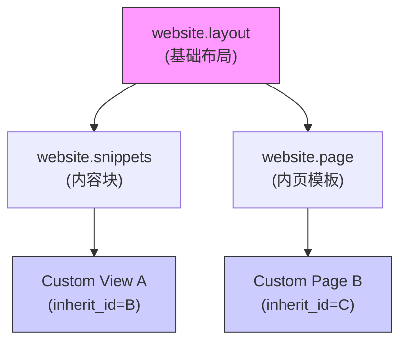

# Website 模块数据模型

## ER 关系图

```mermaid
erDiagram
    company ||--o{ website : "企业拥有网站"
    website ||--o{ website_menu : "菜单结构"
    website_menu ||--o{ website_menu : "菜单层级"
    website ||--o{ website_page : "页面管理"
    website ||--o{ ir_ui_view : "QWeb视图"
    website_page ||--|| ir_ui_view : "关联视图"
    ir_ui_view ||--o{ ir_ui_view : "视图继承"
    ir_ui_view ||--o{ ir_module_module : "模块来源"

    website {
        int id PK
        string name
        string domain
        int default_lang_id FK
        int company_id FK
        string theme_id
        bool cdn_activated
        string cdn_base_url
        bool social_twitter
        bool social_facebook
        bool social_github
        bool social_linkedin
        bool social_youtube
        bool social_instagram
        datetime create_date
    }

    ir_ui_view {
        int id PK
        string name
        string type
        string key
        text arch_db "XML架构"
        int website_id FK "多网站隔离"
        bool active
        int inherit_id FK "继承视图"
        int priority
        string mode "primary/extension"
    }

    website_menu {
        int id PK
        string name
        string url
        int parent_id FK "上级菜单"
        int website_id FK
        int sequence
        bool is_visible
        bool is_mega_menu
        string mega_class
    }

    website_page {
        int id PK
        string name
        string url
        int website_id FK
        int view_id FK "ir.ui.view"
        bool website_indexed "SEO索引"
        bool is_published "发布状态"
        string meta_description
        string meta_keywords
        datetime create_date
        datetime write_date
    }
}
```

## 核心表字段说明

### website（网站实例）

| 字段名 | 类型 | 说明 | 业务含义 |
|--------|------|------|---------|
| id | integer | 主键 | 网站唯一标识 |
| name | char(128) | 网站名称 | 如"主站"、"英文站" |
| domain | char(255) | 域名 | 绑定域名，支持多站点 |
| default_lang_id | integer | 默认语言 | 站点的默认翻译语言 |
| company_id | integer | 所属公司 | 多公司隔离 |
| theme_id | char(64) | 主题标识 | 当前使用的主题 |
| cdn_activated | boolean | CDN加速 | 是否启用CDN |
| cdn_base_url | char(255) | CDN地址 | 静态资源CDN |
| social_* | boolean | 社交链接 | 各平台社交账号开关 |

### ir.ui.view（QWeb 视图/页面）

| 字段名 | 类型 | 说明 | 业务含义 |
|--------|------|------|---------|
| id | integer | 主键 | 视图唯一标识 |
| name | char(256) | 视图名称 | 后台显示名称 |
| type | char(32) | 视图类型 | qweb/page/form/tree等 |
| key | char(128) | 视图键值 | 模块唯一键，如 website.demo_homepage |
| arch_db | text | XML架构 | QWeb XML主体内容 |
| website_id | integer | 归属网站 | 多网站时区分，NULL表示全局 |
| active | boolean | 激活状态 | 禁用后可保留但不可用 |
| inherit_id | integer | 父视图ID | 继承关系，用于覆盖 |
| priority | integer | 优先级 | 数值越小越优先 |
| mode | selection | 继承模式 | primary(主)/extension(扩展) |

### website.menu（网站菜单）

| 字段名 | 类型 | 说明 | 业务含义 |
|--------|------|------|---------|
| id | integer | 主键 | 菜单唯一标识 |
| name | char(128) | 菜单名称 | 显示文本 |
| url | char(1024) | 链接地址 | /page/aboutus, /shop, /blog |
| parent_id | integer | 上级菜单 | 支持多级菜单 |
| website_id | integer | 归属网站 | 多网站菜单隔离 |
| sequence | integer | 排序序号 | 菜单排列顺序 |
| is_visible | boolean | 可见性 | 前端是否显示 |
| is_mega_menu | boolean |  mega菜单 | 是否展开大菜单 |
| mega_class | char(256) | mega样式 | 自定义CSS类 |

### website.page（页面）

| 字段名 | 类型 | 说明 | 业务含义 |
|--------|------|------|---------|
| id | integer | 主键 | 页面唯一标识 |
| name | char(128) | 页面名称 | 后台/SEO标题 |
| url | char(512) | 页面URL | 访问路径，如 /contactus |
| website_id | integer | 归属网站 | 多网站隔离 |
| view_id | integer | 关联视图 | 对应的 QWeb 视图 |
| website_indexed | boolean | SEO索引 | 是否被搜索引擎收录 |
| is_published | boolean | 发布状态 | 草稿(false) vs 已发布(true) |
| meta_description | text | SEO描述 | 搜索引擎显示描述 |
| meta_keywords | char(256) | SEO关键词 | 搜索引挚关键词 |

## QWeb 视图继承关系



- **arch_db 中的 `t-call`**: 引用其他视图（如 `website.layout`）作为基础模板
- **arch_db 中的 `xpath`**: 用于精确定位继承视图中的插入点
- **arch_db 中的 `t-name`**: 模板名称定义

## 业务场景映射

### 页面发布状态机

```
draft(草稿) ────[发布按钮]────▶ published(已发布)
     │                              │
     │                         [取消发布]
     │                              │
     └──────────◀──────────────────┘
              (is_published = False)
```

### URL 路由与视图映射

| URL | 路由 | 说明 |
|-----|------|------|
| / | website.homepage | 首页 |
| /contactus | website.contactus | 联系我们 |
| /shop | eshop.catalog | 电商产品列表 |
| /blog | blog.posts | 博客列表 |
| /page/\<slug\> | website.page | 动态页面 |

### 多语言与多网站

- **多语言**: `website` 绑定 `default_lang_id`，`ir.ui.view` 通过 `website_id` + `lang` 实现翻译变体
- **多网站**: 不同 `website_id` 共享或独立 `ir.ui.view`，实现一套代码多站点
- **主题切换**: 不同 `theme_id` 提供不同视觉样式
